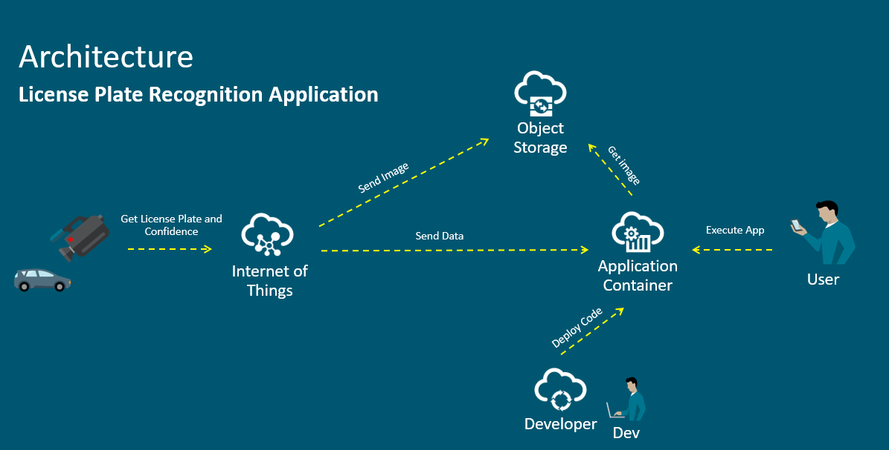

OpenALPR
==================================

# OPENALPR SERVER

1) Update the deployment.json file with your credentials.
2) Create a zip file with just the files inside the openalpr_server folder (do not include the folder).
3) Go to the Oracle Application Container Cloud Service and create a new application using the zip file.

# OPENALPR CLIENT

You can install this application on Windows (PC) or Ubuntu (RaspberryPi)

### Windows installation

1) Download OpenALPR: https://github.com/openalpr/openalpr/releases/download/v2.3.0/openalpr-2.3.0-win-64bit.zip.
2) Unzip the downloaded file.
3) Update the deployment.json file with your credentials and folders information.
4) Create a new Python or Anaconda environment: conda create -n openalpr python=3.6
5) Install the packages of the requirement.txt file using PIP: pip install -r requirement.txt
6) Start the application: python app.py -s True

### Oracle IOT configuration

1) Create a new IOT application
2) Associate the Device Model called "Camera" with your Application.